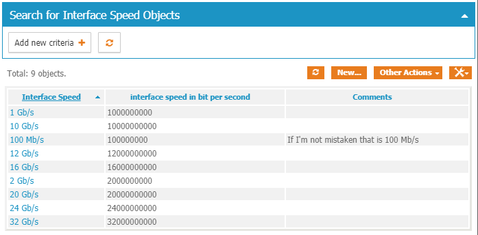
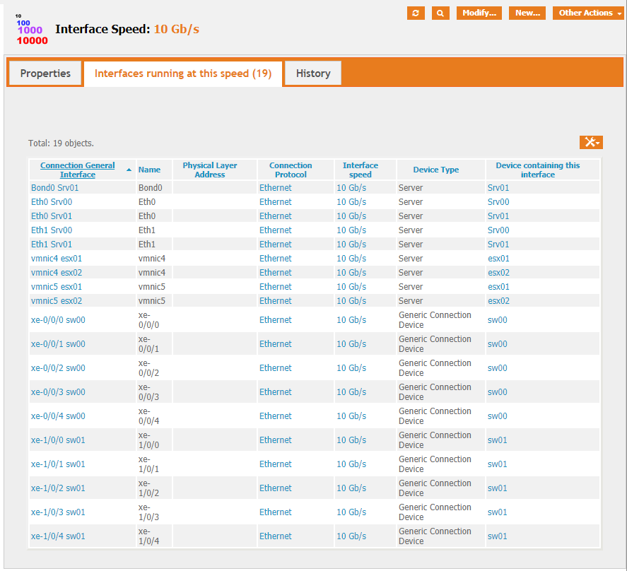
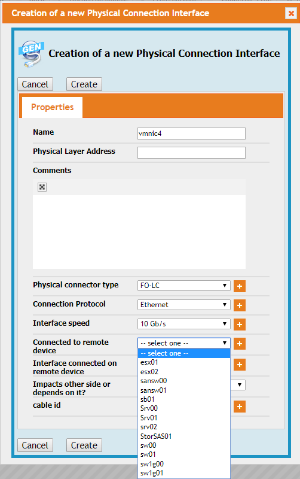
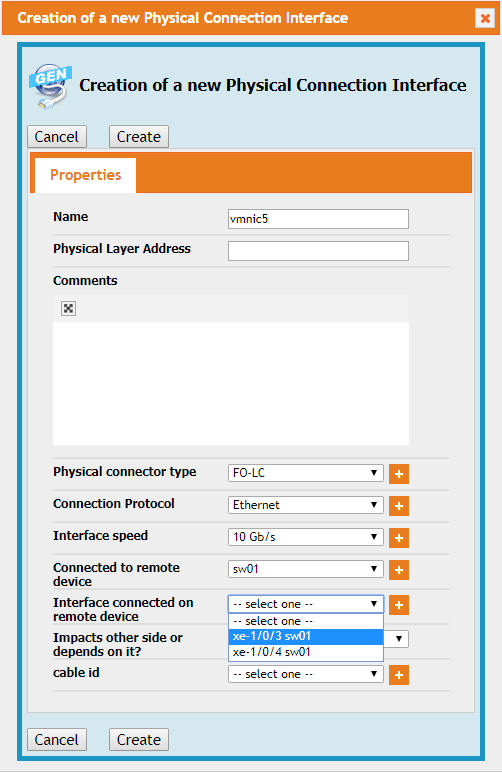
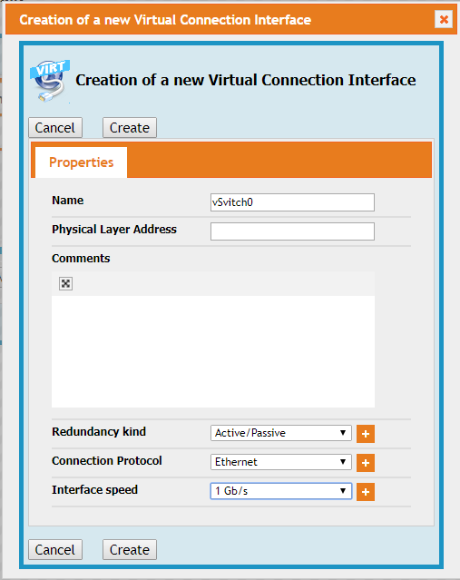
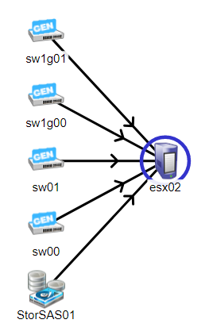
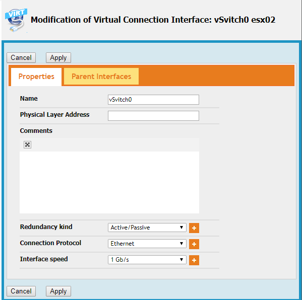
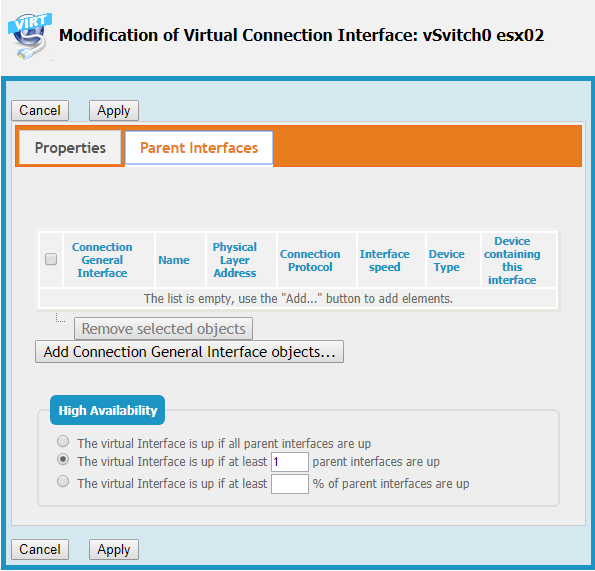
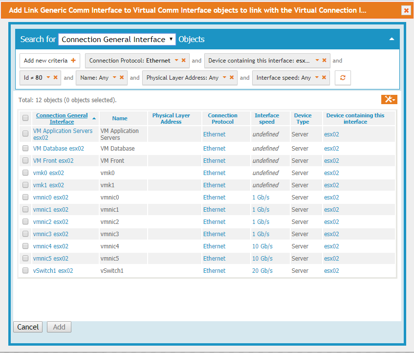
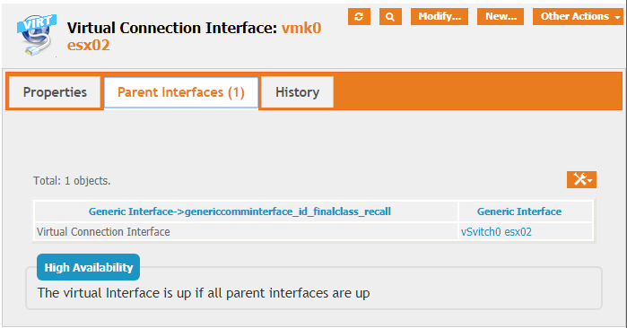

# iTop-Generic-Connection
Creates Generic Connection Devices and Interfaces, instead of specialized Network Devices /interfaces, SAN Devices/interfaces...

This extension is an evolution of the now discontinued iTop-generic-comm-interface

# Table of Content

* [iTop-Generic-Connection](#itop-generic-connection)

  * [State](#state)

* [Goal](#goal)

* [Usage](#usage)

  * [Walking trough an existing configuration](#walking-trough-an-existing-configuration)

  * [Find other information](#find-other-information)

  * [Adding devices or interfaces](#adding-devices-or-interfaces)

    * [Adding Physical and Virtual interfaces to existing class of CI](#adding-physical-and-virtual-interfaces-to-existing-class-of-ci)

    * [Creation of a Generic Connection Device](#creation-of-a-generic-connection-device)

* [Thanks](#thanks)

* [Installation](#installation)

  * [Dependencies](#dependencies)

  * [Download](#download)

* [Releases](#releases)

## State

Technically, this extension is still in beta. In fact, the subject was much bigger than I tought, and I may have missed some points. So, it's too early to put it in a real production, but I don't think that some big changes are to come. specifically, I think the Database Schema is OK now and should not have 'destructive changes'.

But I'm really interested knowing your opinion about this extension, and don't hesitate to put your comments on this forum.

[iTop Generic Connection Extension Beta Available](https://sourceforge.net/p/itop/discussion/922360/thread/66a4dd2310/)

# Goal

Itop come with a network interface really IP oriented. If you add the datacenter module, then you'll also have a SAN interface type.

This extension adds a more generic kind of interface, with a 'connector type' (Fiber, RJ-45, RS-232, ...) and a 'protocol-type' (Ethernet, FC, FCoE, ...)

Virtual interfaces are also available, and link between virtual interfaces and others interfaces (using the same protocol) is possible, allowing a complete (and complex :)) representation of the configuration.

Also, this extension permit direct attach between devices so don't be surprised to see the possibility to interconnect servers (for a back to back connection, maybe)

Redundancy is available also : you can have a virtual interface over two physical interfaces and says that  life can continue with only one physical interfaces up.

There is also a 'Generic Connection Device' for the same reason.

Also, you build the connection between the equipment at an interface level (Eth0 of server1 is connected on port 4 of switch0) and iTop builds for you the higher dependencies (server1 depends on switch0)

This stays on the OSI level 1 or 2, I'm not sure (yet) that this should include high level information (IP address, gateway...)

# Usage

## Walking trough an existing configuration

After installation, you have one new kind of CI, Generic Connection Device. This device can be a Network Switch, a SAN Switch, or any kind of device you use to interconnect other CI. One could choose to put physical firewall in that category.

You'll also find for all your connectable CI two nex tabs :

* Physical Connection Interface(s) are just that : interfaces you can put a cable on to interconnect to other devices
* Virtual Connection Interface(s) are internal connector, linking together the CI.

Let's see an example : One hypervisor with two 1 Gb/s interfaces for the management, two 10 Gb/s interfaces for vMotion an Virtual Machines, two unused 1 Gb/s interfaces and two SAS connection to a direct attached SAS storage.

Here the view of the physical interfaces :

(Don't worry about the 'cable id' column, that is a 'work in progress' in another extension)

And the view of the virtual interfaces :

OK, so far, so good, but what for ?

For once, all kind of interfaces are in one tab and I think it's easier to manage

Also, you can build in iTop nearly any 'real life configuration', and you can show it. For instance here is the 'depend on' view for the Vmotion VMkernel :

More interesting, if we go on the other end, on one switch interface, in that case xe-1/0/2, and show the impact :

So, all is good, we see that the loss of this interface (alone !) is not a big deal as long as vmnic4 is still up (and we also see all parts of the configuration that depends on vSwitch1)

But, even if it the real map of connections, in case of a malfunction, we are generally most interested in a more 'high level map' (I have a trouble on sw01, what is the impact on my Information System ?).

Not to worry, the extension did all the dirty calculation for you :

Or, from the ESXi perspective :

Here is an interesting aspect : the StorSAS01 is shown as 0/1 and not 0/2. Why ? Shall we see ?

I have two physical SAS interfaces, and one Virtual interface over it. From the vSAS esx01 point of vue, the path are redundant :

Well, yes, the paths are redundant, but the storage system is not (there is only one storage system !) So, even with two paths between the ESXi server and the storage area, if the storage area is down, the ESXi will probably encounter some troubles...

This is even more visible from the 'impacts' view of StorSAS01 :

## Find other information

I'm not a big fan of text field when it come of things that you have many times. So I created a lot of 'Categories' :

* **Interface speed** : I think that the speed of an interface is a limited choice. No need to write down again an again the speed (possibly, if the field is 'free', in different format : one will set all speed in Mb/s to gain 6 zeroes, another will set speed in Gb/s to gain 9 zeroes..)
* **Connector type** : Do you really have more than 10 kind of connectors to interconnect all your information system? We don't :)
* **Connection protocol** : for a lot of company nowadays, Ethernet will be enough here
* **Generic Connection device Category** : until now, iTop only knew two of them : Network Device and SAN Switches.
* **Redundancy Mode** : Again, 5 to 10 categories is more than enough in my knowledge.

As all these Categories are iTop classes, you have an access from the 'Configuration Management' --> 'Overview Panel (in the 'Miscellaneous' Category)' so you can find all your connector type, or Redundancy protocol in one place.

For the Speed, on my test system, You see that :

And then, choosing 10 Gb/s, and then the 'Interfaces running at this speed' you have a complete list of these interfaces :

## Adding devices or interfaces

### Adding Physical and Virtual interfaces to existing class of CI

For the existing devices, just add, modify or remove devices as before. The changes are in the two new tabs "Physical Connection Interface(s)" and "Virtual Connection Interface(s)"

I'll add a new esx,named esx02. This is the same server as esx01, I could export esx01 interfaces and import them, but that's not the goal !

I just put a name (esx02) and select the 'Physical Connection Interface(s)' Tab :

After selecting 'Create a new Physical Connection Interface', you see (already filled) :

In that view, you a few 'text' fields fields : Name, Physical Layer Address and Comments. The other fields are in facts items from external lists (Again, forget 'cable id')

For Physical connector type, you'll have at the beginning ... Nothing, witch is annoying as this field (as is 'Connection Protocol') is mandatory! Pushing the '+' sign will let you create your connectors :

Same song for Connection Protocol.

For interface Speed, it's a little different : If you create a new speed, the speed is to give in b/s (yes, bits/second, witch gives a lot of 0 novadays...) But you'll have to do that only once, after that you'll see speed in a more comfortable way : 24 Gb/s is a little easier to read than 24000000000 b/s in my opinion.

If you choose to set-up a connection to a remote device at this time, you get a full list of all compatible devices (I probably could improve the filter here...) :

But then, in the 'Interface connected on remote device' you only see compatible interface (same protocol, connector can be different) and non connected, so you can get an empty list.

If you choose a compatible device with non connected ports, you'll see something like that :

Just continue until all your physical Interfaces are setup, and then you can go to the 'Virtual Connection Interface(s)' Tab.

Same logic as New-Physical-Interface. Mandatory fields are 'Name', 'Redundancy kind' and 'Connection Protocol'.

**About the 'redundancy kind' field** : In this field, you explain the redundancy used by the equipment. That can be LACP, or just Active/Passive, or whatever. If your virtual Interface doesn't build a redundancy protocol, I suggest the use of something like 'direct' or 'none'. In any case, that field has no impact in the way iTop compute the redundancy (this will come later).

'Et voilà', all your interfaces (physical and virtual) are added to your server (8 of each in my sample, see above). But hold on, the redundancy is not good at all ?

This is totally normal ! We created virtual and physical interfaces, but no link between them !

And here come the 'tricky part' of the story : as the link are on the interface level, we have to set-up those links on the interfaces, too, not on the device. Seems understandable to me, but a little strange in operation (That is only a short adaptation time).

So, back to our server, in the 'virtual interface tab', click on one interface to configure, and then, click modify.

Here for vSwitch0 :

You should not have any changes to do in that tab.  Click on the 'Parent Interface'.

In the bottom part, you set the redundancy configuration as seen by iTop. The default value, shown here, works quite well for a resilient double attachment to the network. If the is no resilience (for example, one vlanized sub interface under an already resilient main interface on a server), then the best choice is 'The virtual Interface is up if all parent interfaces are Up'

you can actually add parent interfaces in the upper part of the screen. Here, you will see all interfaces of this device with the same protocol, excluding the interface you are working on. Yes, physical and virtual interfaces. While it's maybe not very common, this is a configuration I need in most of my servers (VLAN over a bonding, different VM networks over a set of adapters...)

for our test esx, and for an Ethernet virtual port, the list is long :

I created 16 interfaces, 13 of them are using Ethernet as protocol. Excluding this one, I have 12 choices.

In that case, I just have to connect vmnic0 and vmnic1

Same configuration for vSwitch 1 and vSAS. But for vSAS, as I had only two other interfaces of the same protocol, the choice was easier :)

for the 5 other Virtual interfaces, the choice is quite different : 

* Each of these interface are connected to one virtual interface (vSwitch0 or vSwitch1) 

* No redundancy

for vmk0, this is the result :

It's done ! A little complicated if you plan (as me) to put every step of your configuration, but this is really helpful after that step. And I really hope to build most if not all of the internal relations in a server automatically.

* **Point of attention** : as it is possible to link nearly anything in a system, it's also possible to create loops. I didn't test the effect, but probably not fine... Be careful!

### Creation of a Generic Connection Device

This step is much easier : You have to have in mind that a generic Connection Device is just an interconnection device.

You set it up like a Network Switch. Of course, the interface are Generic Physical and Generic Virtual Interfaces, but there is no differences for that kind of device.

There is only one point of attention : 

As a 'Generic Connection Device' can be a little to generic as category, there is a new mandatory field : 'Device Category'. You can see that as a sub category of Generic Connection Device, but this one is only useful in filter, or to find say all 'Network switches' or all 'FC SAN Devices'.

# Thanks

I really want to thanks :

* The whole Combodo team who brings to us such a remarkable (an nearly unbreakable!) tool
* All the people on the iTop forum, including but not only Guillaume Lajarige/ Molkobain, Pierre Goiffon, Jeffrey, vdumas...
* ... You ! You who read that far !

# Installation

## Dependencies

I think that this extension has no specific constraints. It should install on a very minimal iTop installation. The 'Datacenter part is needed (and, normally, the extension should not install without this part)'

Until today, I had the feeling that this extension should work in itop starting in version 2.5.0, but today, I add some uniqueness rules, and that is a part of iTop 2.6, so better to install on a 2.6.x or newer version.

## Download

As for all my extensions, just download the zip file, and copy the 'schirrms-...' directory in your extensions directory, then rerun the setup as usual.

Or you can instead just download a 'release zip' and unzip this release in your extension directory.

# Releases

* [0.7.3-beta]( ./schirrms-generic-connection-release-0.7.3-beta.zip)	2019-11-17	First 'public beta', stable enough in my opinion