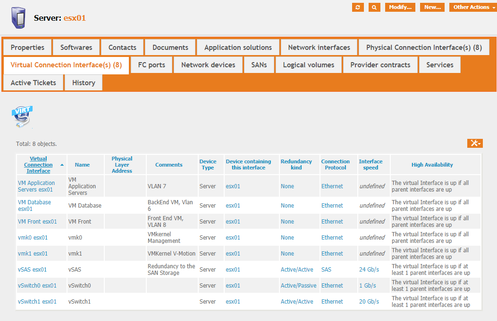
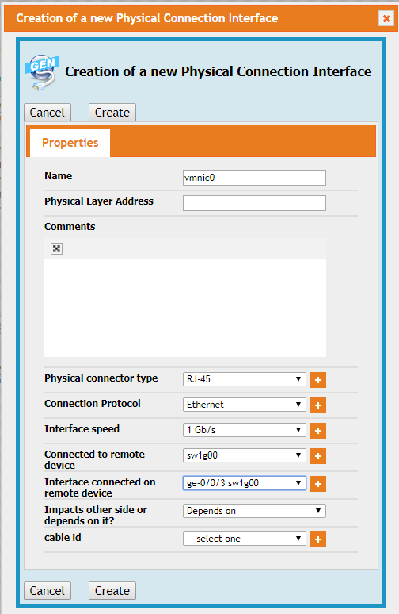

# iTop-Generic-Connection
Creates Generic Connection Devices and Interfaces, instead of specialized Network Devices /interfaces, SAN Devices/interfaces...

This extension is an evolution of the now discontinued iTop-generic-comm-interface

# Goal

Itop come with a network interface really IP oriented. If you add the datacenter module, then you'll also have a SAN interface type.

This extension adds a more generic kind of interface, with a 'connector type' (Fiber, RJ-45, RS-232, ...) and a 'protocol-type' (Ethernet, FC, FCoE, ...)

Virtual interfaces are also available, and link between virtual interfaces and others interfaces (using the same protocol) is possible, allowing a complete (and complex :)) representation of the configuration.

Also, this extension permit direct attach between devices so don't be surprised to see the possibility to interconnect servers (for a back to back connection, maybe)

Redundancy is available also : you can have a virtual interface over two physical interfaces and says that only life can continue with only one physical interfaces up.

There is also a 'Generic Connection Device' for the same reason.

Also, you build the connection between the equipment at an interface level (Eth0 of server1 is connected on port 4 of switch0) and iTop builds for you the higher dependencies (server1 depends on switch0)

This stays on the OSI level 1 or 2, I'm not sure (yet) that this should include high level information (IP address, gateway...)

# Usage

## Walking trough an existing configuration

After installation, you have one new kind of CI, Generic Connection Device. This device can be a Network Switch, a SAN Switch, or any kind of device you use to interconnect other CI. One could choose to put physical firewall in that category.

You'll also find for all your connectable CI two nex tabs :

* Physical Connection Interface(s) are just that : interfaces you can put a cable on to interconnect to other devices
* Virtual Connection Interface(s) are internal connector, linking together the CI.

Let's see an example : One hypervisor with two 1 Gb/s interfaces for the management, two 10 Gb/s interfaces for vMotion an Virtual Machines, two unused 1 Gb/s interfaces and two SAS connection to a direct attached SAS storage.

Here the view of the physical interfaces :

(Don't worry about the 'cable id' column, that is a 'work in progress' in another extension)

And the view of the virtual interfaces :

OK, so far, so good, but what for ?

For once, all kind of interfaces are in one tab and I think it's easier to manage

Also, you can build in iTop nearly any 'real life configuration', and you can show it. For instance here is the 'depend on' view for the Vmotion VMkernel :

More interesting, if we go on the other end, on one switch interface, in that case xe-1/0/2, and show the impact :

So, all is good, we see that the loss of this interface (alone !) is not a big deal as long as vmnic4 is still up (and we also see all parts of the configuration that depends on vSwitch1)

But, even if it the real map of connections, in case of a malfunction, we are generally most interested in a more 'high level map' (I have a trouble on sw01, what is the impact on my Information System ?).

Not to worry, the extension did all the dirty calculation for you :

Or, from the ESXi perspective :

Here is an interesting aspect : the StorSAS01 is shown as 0/1 and not 0/2. Why ? Shall we see ?

I have two physical SAS interfaces, and one Virtual interface over it. From the vSAS esx01 point of vue, the path are redundant :

Well, yes, the paths are redundant, but the storage system is not (there is only one storage system !) So, even with two paths between the ESXi server and the storage area, if the storage area is down, the ESXi will probably encounter some troubles...

This is even more visible from the 'impacts' view of StorSAS01 :

## Adding, devices, interfaces

For the existing devices, just add, modify or remove devices as before. The changes are in the two new tabs "Physical Connection Interface(s)" and "Virtual Connection Interface(s)"

I'll add a new esx,named esx02. This is the same server as esx01, I could export esx01 interfaces and import them, but that's not the goal !

I just put a name (esx02) and select the 'Physical Connection Interface(s)' Tab :

After selecting 'Create a new Physical Connection Interface', you see (already filled) :

In that view, you a few 'text' fields fields : Name, Physical Layer Address and Comments. The other fields are in facts items from external lists (Again, forget 'cable id')

For Physical connector type, you'll have at the beginning ... Nothing, witch is annoying as this field (as is 'Connection Protocol') is mandatory! Pushing the '+' sign will let you create your connectors :

Same song for Connection Protocol.

For interface Speed, it's a little different : If you create a new speed, the speed is to give in b/s (yes, bits/second, witch gives a lot of 0 novadays...) But you'll have to do that only once, after that you'll see speed in a more comfortable way : 24 Gb/s is a little easier to read than 24000000000 b/s in my opinion.

# Installation

As for all my extensions, just download the zip file, and copy the 'schirrms-...' directory in your extensions directory, then rerun the setup as usual.

Or you can instead just download a 'release zip' and unzip this release in your extension directory.

# Releases

* [0.7.3-beta]( ./schirrms-generic-connection-release-0.7.3-beta.zip)	2019-11-17	First 'public beta', stable enough in my opinion